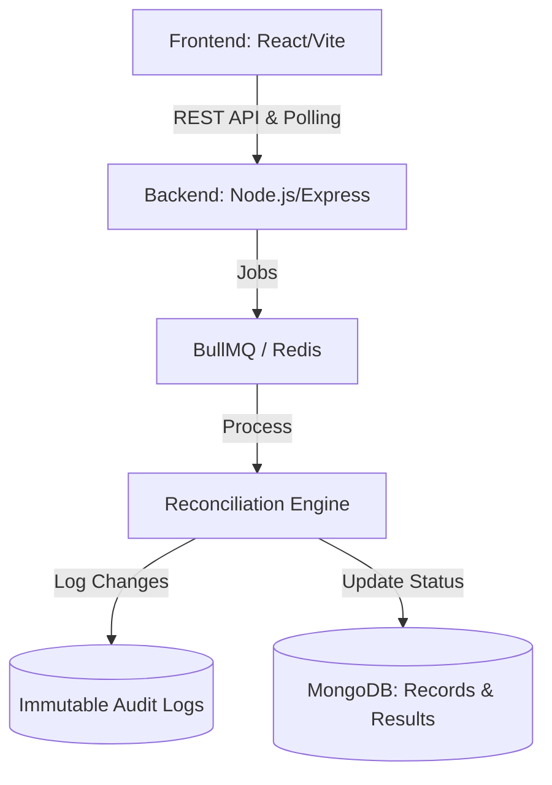

# Smart Reconciliation & Audit System

A robust, enterprise-grade system for matching financial/operational records between external and internal datasets with a strictly immutable audit trail.

## 1️⃣ System Architecture & High-Level Design

The system follows a modern **client–server architecture** designed for reliability and scalability.

### Architecture Flow


### Components
- **Frontend**: Handles React-based file uploads, column mapping, asynchronous status polling, and visual audit timeline representation.
- **Backend API**: Manages authentication, orchestrates file processing jobs, enforces security policies, and exposes endpoints for data retrieval.
- **Reconciliation Engine**: A dedicated service (running via BullMQ workers) that performs the heavy lifting of matching source and internal records based on configurable logic.
- **Database (MongoDB)**: Stores transaction data, upload job states, and a dedicated collection for **immutable audit logs**.

## 2️⃣ Key Assumptions Made During Implementation

- **Uniqueness**: Each transaction is uniquely identified by a `Transaction ID (TxID)` or equivalent identifier in the source/internal data.
- **File Formats**: Uploaded files are assumed to be in standard `CSV` or `Excel (.xlsx)` formats.
- **Partial Matching**: A partial match is determined when either the Reference Number matches or the amount variance is within the threshold (default **±2%**).
- **Time Source**: System time (UTC) is used as the absolute source of truth for all audit log timestamps to ensure chronological integrity.

## 3️⃣ Design Trade-offs & Rationale

- **Polling vs. WebSockets**: The system uses **2-second polling** to track upload and processing status instead of WebSockets. 
    *   *Rationale*: This approach was chosen for simplicity, higher reliability in varying network conditions, and easier backend scaling with standard load balancers.
- **Immutable Audit Collection**: Audit logs are stored in a **separate, strictly immutable collection**.
    *   *Rationale*: Ensuring compliance and preventing accidental (or malicious) modification of history, even though it slightly increases storage usage.
- **Frontend Diffing**: Field-level differences are highlighted at render-time.
    *   *Rationale*: Storing raw `oldValue` and `newValue` objects allows for flexible UI rendering and easier auditing compared to storing pre-formatted text.

## 4️⃣ Known Limitations & Constraints

- **Single Record Updates**: Manual corrections are handled on a per-record basis; bulk manual editing is currently not supported.
- **Processing Scale**: Very large files (>100,000 records) may experience longer processing times depending on server resources.
- **Near-Real-Time**: Status updates are near-real-time due to the 2-second polling interval.
- **Audit Immutability**: Audit logs are strictly **read-only**; they cannot be edited or deleted through the API or application interface, ensuring high-fidelity integrity.

## 5️⃣ Setup & Run Instructions

### 🛠 Prerequisites
- **Node.js** (v18 or higher)
- **MongoDB** (Local instance or Atlas connection string)
- **Redis Server** (Used for job queueing)

### 🚀 Running Local Environment

1. **Clone the repository**
   ```bash
   git clone https://github.com/example/smart-recon-audit.git
   cd smart-recon-audit
   ```

2. **Setup Backend**
   ```bash
   cd server
   npm install
   cp .env.example .env
   # Edit .env with your MONGO_URI and REDIS details
   npm run dev
   ```

3. **Setup Frontend**
   ```bash
   cd ../client
   npm install
   npm run dev
   ```

### 🔑 Environment Variables
| Variable | Description | Default |
| :--- | :--- | :--- |
| `PORT` | Backend server port | `5000` |
| `MONGO_URI` | MongoDB Connection URL | `mongodb://localhost:27017/smart-recon` |
| `JWT_SECRET` | Secret for signing tokens | `change_me` |
| `REDIS_HOST` | Redis instance host | `127.0.0.1` |
| `REDIS_PORT` | Redis instance port | `6379` |

---
*Developed for robust financial reconciliation and audit compliance.*
